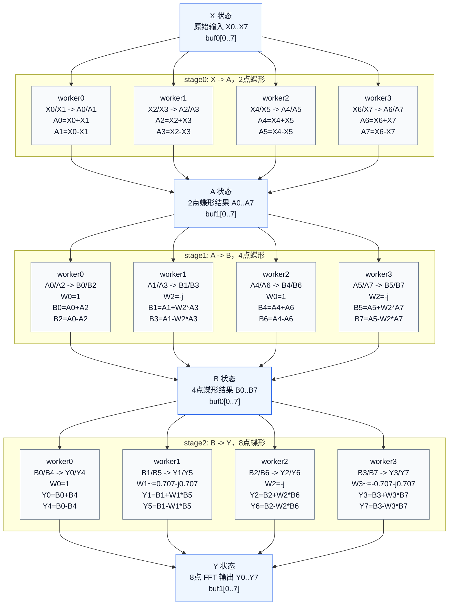

# 汇编集合

本清单展示 ROM 程序的可读汇编形式。实际保存在
`rtl/mcu4_worker_instr_rom.vhd` 中的 32-bit 指令字采用
`Armv7-A/R AArch32 A32` 标准编码子集；每类指令的 bit 字段见
`docs/02_指令定义.md`。

## 记号

```text
[r0, #0x40 + 4*n] = unified dmem word[16+n]，物理缓冲区 buf0[n]
[r0, #0x80 + 4*n] = unified dmem word[32+n]，物理缓冲区 buf1[n]
packed complex word = {imag[15:0], real[15:0]}，低半字为实部，高半字为虚部
X[n] = 8 个原始输入，初始放在 buf0[n]
A[n] = 做完 2 点蝶形后的结果，放在 buf1[n]
B[n] = 做完 4 点蝶形后的结果，放在 buf0[n]
Y[n] = 做完 8 点 FFT 后的最终输出，放在 buf1[n]
stage0 = 2 点蝶形，X -> A，buf0 -> buf1
stage1 = 4 点蝶形，A -> B，buf1 -> buf0
stage2 = 8 点蝶形，B -> Y，buf0 -> buf1
NOP                = MOV r0, r0 = 0xE1A00000
B .                = 0xEAFFFFFE，标准 A32 自跳转，作为顶层完成哨兵
```

## FFT 计算流程图



## FFT worker0

```asm
pc00: MOV     r0, #0                 ; dmem 基址 = 0
pc01: MOV     r1, #91                ; Q7 旋转系数，91/128 ~= sqrt(1/2)
pc02: PKHBT   r3, r1, r1, LSL #16    ; r3 = {+91, +91}
pc03: SSUB16  r4, r0, r3             ; r4 = {-91, -91}

; stage0: 2 点蝶形，X0/X1 -> A0/A1，W0 = 1
pc04: LDR     r5, [r0, #0x40]        ; X0
pc05: LDR     r6, [r0, #0x44]        ; X1
pc06: SADD16  r10, r5, r6            ; A0 = X0 + X1
pc07: SSUB16  r11, r5, r6            ; A1 = X0 - X1
pc08: STR     r10, [r0, #0x80]       ; buf1[0] = A0
pc09: STR     r11, [r0, #0x84]       ; buf1[1] = A1

; stage1: 4 点蝶形，A0/A2 -> B0/B2，W0 = 1
pc10: LDR     r5, [r0, #0x80]        ; A0
pc11: LDR     r6, [r0, #0x88]        ; A2
pc12: SADD16  r10, r5, r6            ; B0 = A0 + A2
pc13: SSUB16  r11, r5, r6            ; B2 = A0 - A2
pc14: STR     r10, [r0, #0x40]       ; buf0[0] = B0
pc15: STR     r11, [r0, #0x48]       ; buf0[2] = B2

pc16: NOP                            ; 对齐其他 worker 的 stage1 路径

; stage2: 8 点蝶形，B0/B4 -> Y0/Y4，W0 = 1
pc17: LDR     r5, [r0, #0x40]        ; B0
pc18: LDR     r6, [r0, #0x50]        ; B4，W0 = 1
pc19: SADD16  r10, r5, r6            ; Y0 = B0 + B4
pc20: SSUB16  r11, r5, r6            ; Y4 = B0 - B4
pc21: STR     r10, [r0, #0x80]       ; buf1[0] = Y0
pc22: STR     r11, [r0, #0x90]       ; buf1[4] = Y4

pc23: NOP                            ; 等待较长的 W1/W3 DSP 路径
pc24: NOP
pc25: NOP
pc26: NOP
pc27: B       .                      ; 完成哨兵
```

## FFT worker1

```asm
pc00: MOV     r0, #0                 ; dmem 基址 = 0
pc01: MOV     r1, #91                ; Q7 旋转系数，91/128 ~= sqrt(1/2)
pc02: PKHBT   r3, r1, r1, LSL #16    ; r3 = {+91, +91}
pc03: SSUB16  r4, r0, r3             ; r4 = {-91, -91}

; stage0: 2 点蝶形，X2/X3 -> A2/A3，W0 = 1
pc04: LDR     r5, [r0, #0x48]        ; X2
pc05: LDR     r6, [r0, #0x4C]        ; X3
pc06: SADD16  r10, r5, r6            ; A2 = X2 + X3
pc07: SSUB16  r11, r5, r6            ; A3 = X2 - X3
pc08: STR     r10, [r0, #0x88]       ; buf1[2] = A2
pc09: STR     r11, [r0, #0x8C]       ; buf1[3] = A3

; stage1: 4 点蝶形，A1/A3 -> B1/B3，W2 = -j
pc10: LDR     r5, [r0, #0x84]        ; A1
pc11: LDR     r6, [r0, #0x8C]        ; A3
pc12: SSAX    r9, r0, r6             ; r9 = W2 * A3，W2 = -j
pc13: SADD16  r10, r5, r9            ; B1 = A1 + W2*A3
pc14: SSUB16  r11, r5, r9            ; B3 = A1 - W2*A3
pc15: STR     r10, [r0, #0x44]       ; buf0[1] = B1
pc16: STR     r11, [r0, #0x4C]       ; buf0[3] = B3

; stage2: 8 点蝶形，B1/B5 -> Y1/Y5，W1 ~= 0.707 - j0.707
pc17: LDR     r5, [r0, #0x44]        ; B1
pc18: LDR     r6, [r0, #0x54]        ; B5
pc19: SMUAD   r7, r6, r3             ; W1*B5 的 real 分量：91*(real+imag)
pc20: SMUSD   r8, r6, r4             ; W1*B5 的 imag 分量：91*(imag-real)
pc21: ASR     r7, r7, #7             ; real 分量缩回 Q7
pc22: PKHBT   r9, r7, r8, LSL #9     ; 打包 W1*B5 -> {imag, real}
pc23: SADD16  r10, r5, r9            ; Y1 = B1 + W1*B5
pc24: SSUB16  r11, r5, r9            ; Y5 = B1 - W1*B5
pc25: STR     r10, [r0, #0x84]       ; buf1[1] = Y1
pc26: STR     r11, [r0, #0x94]       ; buf1[5] = Y5
pc27: B       .                      ; 完成哨兵
```

## FFT worker2

```asm
pc00: MOV     r0, #0                 ; dmem 基址 = 0
pc01: MOV     r1, #91                ; Q7 旋转系数，91/128 ~= sqrt(1/2)
pc02: PKHBT   r3, r1, r1, LSL #16    ; r3 = {+91, +91}
pc03: SSUB16  r4, r0, r3             ; r4 = {-91, -91}

; stage0: 2 点蝶形，X4/X5 -> A4/A5，W0 = 1
pc04: LDR     r5, [r0, #0x50]        ; X4
pc05: LDR     r6, [r0, #0x54]        ; X5
pc06: SADD16  r10, r5, r6            ; A4 = X4 + X5
pc07: SSUB16  r11, r5, r6            ; A5 = X4 - X5
pc08: STR     r10, [r0, #0x90]       ; buf1[4] = A4
pc09: STR     r11, [r0, #0x94]       ; buf1[5] = A5

; stage1: 4 点蝶形，A4/A6 -> B4/B6，W0 = 1
pc10: LDR     r5, [r0, #0x90]        ; A4
pc11: LDR     r6, [r0, #0x98]        ; A6
pc12: SADD16  r10, r5, r6            ; B4 = A4 + A6
pc13: SSUB16  r11, r5, r6            ; B6 = A4 - A6
pc14: STR     r10, [r0, #0x50]       ; buf0[4] = B4
pc15: STR     r11, [r0, #0x58]       ; buf0[6] = B6

pc16: NOP                            ; 对齐其他 worker 的 stage1 路径

; stage2: 8 点蝶形，B2/B6 -> Y2/Y6，W2 = -j
pc17: LDR     r5, [r0, #0x48]        ; B2
pc18: LDR     r6, [r0, #0x58]        ; B6
pc19: SSAX    r9, r0, r6             ; r9 = W2 * B6，W2 = -j
pc20: SADD16  r10, r5, r9            ; Y2 = B2 + W2*B6
pc21: SSUB16  r11, r5, r9            ; Y6 = B2 - W2*B6
pc22: STR     r10, [r0, #0x88]       ; buf1[2] = Y2
pc23: STR     r11, [r0, #0x98]       ; buf1[6] = Y6

pc24: NOP                            ; 等待较长的 W1/W3 DSP 路径
pc25: NOP
pc26: NOP
pc27: B       .                      ; 完成哨兵
```

## FFT worker3

```asm
pc00: MOV     r0, #0                 ; dmem 基址 = 0
pc01: MOV     r1, #91                ; Q7 旋转系数，91/128 ~= sqrt(1/2)
pc02: PKHBT   r3, r1, r1, LSL #16    ; r3 = {+91, +91}
pc03: SSUB16  r4, r0, r3             ; r4 = {-91, -91}

; stage0: 2 点蝶形，X6/X7 -> A6/A7，W0 = 1
pc04: LDR     r5, [r0, #0x58]        ; X6
pc05: LDR     r6, [r0, #0x5C]        ; X7
pc06: SADD16  r10, r5, r6            ; A6 = X6 + X7
pc07: SSUB16  r11, r5, r6            ; A7 = X6 - X7
pc08: STR     r10, [r0, #0x98]       ; buf1[6] = A6
pc09: STR     r11, [r0, #0x9C]       ; buf1[7] = A7

; stage1: 4 点蝶形，A5/A7 -> B5/B7，W2 = -j
pc10: LDR     r5, [r0, #0x94]        ; A5
pc11: LDR     r6, [r0, #0x9C]        ; A7
pc12: SSAX    r9, r0, r6             ; r9 = W2 * A7，W2 = -j
pc13: SADD16  r10, r5, r9            ; B5 = A5 + W2*A7
pc14: SSUB16  r11, r5, r9            ; B7 = A5 - W2*A7
pc15: STR     r10, [r0, #0x54]       ; buf0[5] = B5
pc16: STR     r11, [r0, #0x5C]       ; buf0[7] = B7

; stage2: 8 点蝶形，B3/B7 -> Y3/Y7，W3 ~= -0.707 - j0.707
pc17: LDR     r5, [r0, #0x4C]        ; B3
pc18: LDR     r6, [r0, #0x5C]        ; B7
pc19: SMUSD   r7, r6, r4             ; W3*B7 的 real 分量：91*(imag-real)
pc20: SMUAD   r8, r6, r4             ; W3*B7 的 imag 分量：-91*(real+imag)
pc21: ASR     r7, r7, #7             ; real 分量缩回 Q7
pc22: PKHBT   r9, r7, r8, LSL #9     ; 打包 W3*B7 -> {imag, real}
pc23: SADD16  r10, r5, r9            ; Y3 = B3 + W3*B7
pc24: SSUB16  r11, r5, r9            ; Y7 = B3 - W3*B7
pc25: STR     r10, [r0, #0x8C]       ; buf1[3] = Y3
pc26: STR     r11, [r0, #0x9C]       ; buf1[7] = Y7
pc27: B       .                      ; 完成哨兵
```

## 基础指令测试

```asm
pc00: MOV     r0, #0
pc01: MOV     r1, #7
pc02: STR     r1, [r0, #0x44]   ; data[1] = MOV result = 7
pc03: MOV     r2, #3
pc04: ADD     r3, r1, r2
pc05: STR     r3, [r0, #0x48]   ; data[2] = ADD result = 10
pc06: SUB     r4, r3, r2
pc07: STR     r4, [r0, #0x4C]   ; data[3] = SUB result = 7
pc08: AND     r5, r3, r1
pc09: STR     r5, [r0, #0x50]   ; data[4] = AND result = 2
pc10: ORR     r6, r5, r2
pc11: STR     r6, [r0, #0x54]   ; data[5] = ORR result = 3
pc12: LDR     r8, [r0, #0x40]   ; data[0] input = 5
pc13: STR     r8, [r0, #0x58]   ; data[6] = LDR result = 5
pc14: MOV     r11, #0
pc15: B       pc17
pc16: MOV     r11, #99          ; skipped poison write
pc17: BL      pc21
pc18: ADD     r12, r10, r11
pc19: STR     r12, [r0, #0x5C]  ; data[7] = control-flow result = 15
pc20: B       .
pc21: MOV     r10, #15
pc22: MOV     pc, lr
```

